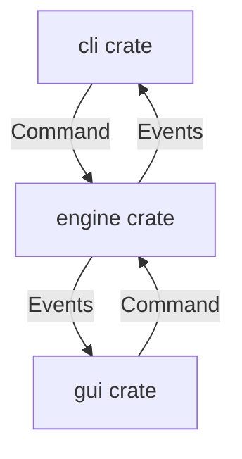

# ARCHITECTURE.md - システムアーキテクチャ設計書

## 1. アーキテクチャ概要

### システム概要
OpenWarsは、ターン制戦略シミュレーションゲームを実現するためのプロジェクトです。コアとなるゲームロジックと、UI（プレゼンテーション層）を完全に分離した設計を採用しています。

### アーキテクチャスタイル
- **採用パターン**: ECS (Entity Component System) ベースのゲームロジック + マルチフロントエンド構成
- **設計原則**: DDD（ドメイン駆動設計）、SOLID原則、DRY原則
- **通信方式**: Rustにおけるイベント駆動およびコマンド（メソッド呼び出し）ベース

## 2. システム構成図

### 全体アーキテクチャ

```text
+-------------------------------------------------------+
|                       UI Layer                        |
|  +-----------------+             +-----------------+  |
|  |       cli       |             |       gui       |  |
|  | (CUI App:       |             | (Tauri Desktop: |  |
|  |  ratatui, etc)  |             |  TypeScript/Vue)|  |
|  +--------+--------+             +--------+--------+  |
|           |                               |           |
+-----------|-------------------------------|-----------+
            | (Command / Event)             |
+-----------|-------------------------------|-----------+
|           v                               v           |
|                     engine (Core)                     |
|  +-------------------------------------------------+  |
|  | Systems: Game Rules, Combat, AI                 |  |
|  +-------------------------------------------------+  |
|  | Components / Resources: Unit, Map, Faction, etc.|  |
|  +-------------------------------------------------+  |
+-------------------------------------------------------+
```

### レイヤー構成

```text
┌─────────────────────────────────────┐
│     Presentation Layer (cli/gui)    │
├─────────────────────────────────────┤
│     Application Layer (Usecase)     │
├─────────────────────────────────────┤
│     Domain Layer (Engine Core)      │
├─────────────────────────────────────┤
│     Infrastructure Layer (Data IO)  │
└─────────────────────────────────────┘
```

## 3. コンポーネント設計

### 主要コンポーネント

| コンポーネント名 | 責務 | 技術スタック | インターフェース |
| --- | --- | --- | --- |
| `engine` | ゲームの純粋なドメインロジック、ECSによる状態管理 | Rust, `bevy_ecs` | Rust public API, Events |
| `cli` | ターミナル上でのTUI描画およびキーボード/マウス入力処理 | Rust, `ratatui`, `crossterm` | `engine`のAPIを直接コール |
| `gui` (未実装) | デスクトップ向けのグラフィカルなUIおよび入力処理 | Tauri, TypeScript, UI Framework | Tauri commands |

### コンポーネント間通信



## 4. データアーキテクチャ

### データフロー
ローカル実行を前提としているため、データの永続化はセーブデータ（JSON）やマスターデータ（CSV等）の読み書きとなります。詳細は `DATABASE.md` を参照してください。

## 5. インフラストラクチャ / デプロイメント
ローカルでビルドして実行するバイナリファイル（Windows, macOS, Linux）として配布します。大規模サーバーインフラは用いません。

## 6. セキュリティアーキテクチャ
N/A (ローカルゲームアプリとしての基本的な安全なファイル入出力などのみ)

## 7. 非機能要件の実現

### パフォーマンス
- **ECSの採用**: `bevy_ecs`を利用した高速なシステム処理とメモリ効率の最適化。
- **UI描画**: `cli`における1フレーム遅延の考慮。

## 8. 技術スタック

| レイヤー | 技術 | バージョン | 選定理由 |
| --- | --- | --- | --- |
| Core Engine | Rust | Edition 2024 | メモリ安全性、パフォーマンス |
| ECS Framework | `bevy_ecs` | 0.15.2 | 高速で柔軟なエンティティ管理 |
| CLI UI | `ratatui` | 0.26 | TUI構築の標準的クレート |
| CLI Input | `crossterm` | 0.27 | クロスプラットフォームな入力処理 |

## 9. 設計判断記録（ADR）

### ADR-001: bevy_ecsの採用
ゲーム状態をComponentとして持ち、処理をSystemとして分離することで、UIとロジックの依存を断ち切る。借用チェッカーとの戦いを避ける。

### ADR-002: 値オブジェクトの多用（Newtypeパターン）
`uuid` をラップした `UnitId` などを使用し、ポインタ（借用）ではなくIDでリレーションを管理する。

## 10. 開発ガイドライン

- ドメインロジックの非漏出を徹底する。UI層にゲームルールを記述しない。
- 詳細は `CONSTRAINTS.md` や `rules/project.md` を参照。
