# V4 AI のターン処理フロー

`execute_ai_turn` は **1ターン全体を実行する関数ではない**。1回の呼び出しで「生産 1 件」または「ユニット 1 件の行動」を決定・発行して `return` する。AI ドライバが同じ Main フェーズ中に再呼び出しすることで、下図の反復を完了する。

```mermaid
flowchart TD
    classDef boundary fill:#edf2f7,stroke:#4a5568,color:#1a202c
    classDef plan fill:#e6fffa,stroke:#0f766e,color:#134e4a
    classDef resolve fill:#fff7ed,stroke:#c2410c,color:#7c2d12
    classDef action fill:#eff6ff,stroke:#2563eb,color:#1e3a8a
    classDef write fill:#fdf2f8,stroke:#be185d,color:#831843

    A([前プレイヤーが Main を終了]) --> B[advance_next_phase]
    B --> B1[全 Unit の HasMoved / ActionCompleted を reset]
    B1 --> B2[PendingMove・AiActionCooldown・AiProductionCooldown・AiTurnStrategyCache を削除]
    B2 --> B3[手番プレイヤーを切替<br/>収入・補給・必要なら日次更新]
    B3 --> C([AI ドライバが execute_ai_turn を反復呼出])

    C --> D{AiProductionCommandQueue に<br/>当ターン・当プレイヤーの命令が残るか}
    D -- Yes --> D1[先頭の生産命令を発行して return]
    D1 --> C
    D -- No --> E{初回計画が必要か?<br/>AiActionCooldown が空 かつ<br/>AiTurnStrategyCache が未計画}

    subgraph P[初回 AI ステップだけ: plan_squads]
        direction TD
        P1[update_squads: 死亡・完了 Squad を整理]
        P2[V4: 首都ルート topology を準備]
        P3[Reserve Squad を除去<br/>SoloFallback を clear<br/>既存の UnitOperationRegistry を正規化]
        P4[V3 共通の戦略分析:<br/>campaign portfolio / 防衛 / 攻勢を作成]
        P5[V4: 同一陸塊の milestone・bridgehead を更新]
        P6[portfolio を AiTurnStrategyCache と<br/>UnitOperationRegistry へ仮予約]
        P7[campaign の輸送・現地 Squad を構成]
        P8[V4: V4DeploymentRegistry の生産済み Entity を<br/>局地 Combat Squad へ先に接続]
        P9[残った free pool で V2/V3 共通の<br/>Defense / Capture / Attack Squad を構成]
        P10[競合を正規化 → Campaign / Deployment を再接続<br/>→ 残りを明示 Reserve にする]
        P11[V4: victory roadmap を照合<br/>→ 最終正規化 → CapitalRoutePath を束縛]
        P1 --> P2 --> P3 --> P4 --> P5 --> P6 --> P7 --> P8 --> P9 --> P10 --> P11
    end

    E -- Yes --> P1
    P11 --> Q[run_squad_beam_search]
    Q --> Q1[generic Squad だけの target をビーム探索で更新<br/>※島 campaign・Transport・V4 protected deployment は除外]
    Q1 --> R
    E -- No --> R

    R{V4 Forming 中の輸送役が<br/>生産施設を塞いでいるか} -- Yes --> R1[隣接マスへ退避を実行<br/>cooldown に記録して return]
    R1 --> C
    R -- No --> S[Transport Squad を最優先で 1 step 実行]
    S --> T{輸送行動があったか}
    T -- Yes --> T1[Load / Drop / Transit / Return を実行<br/>影響 cargo も cooldown に記録して return]
    T1 --> C
    T -- No --> U1

    subgraph A1[通常行動の決定: decide_ai_action_v2]
        direction TD
        U1[行動可能 Entity を収集<br/>輸送 Squad 関連 Entity は通常候補から除外]
        U2[UnitOperationRegistry から唯一の Campaign owner / Squad を解決]
        U3{Campaign owner があるのに<br/>具体 Squad が無いか}
        U4[この Entity は今回の候補から除外<br/>後段の再接続に委ねる]
        U5[行動先を決定:<br/>CapitalRoutePath の waypoint があればそれを優先<br/>なければ Squad.target]
        U6[到達可能マスごとに Capture / Attack / Wait / Merge を採点]
        U7[Attack の優先度:<br/>戦略目標かつ有利 → 同作戦圏の有利標的<br/>→ 戦略目標への不利交換許容 → RouteAdvance → 通常スコア]
        U8[全 Entity の候補から最高 rank の 1 行動を選ぶ]
        U1 --> U2 --> U3
        U3 -- Yes --> U4
        U3 -- No --> U5 --> U6 --> U7 --> U8
        U4 --> U8
    end

    U8 --> V{通常行動を選べたか}
    V -- Yes --> V1[execute_ai_command<br/>作戦実績を record → cooldown に記録 → return]
    V1 --> C
    V -- No --> W[V4: reconcile_v4_end_turn_reserves<br/>固定点で Campaign / Deployment を再接続]
    W --> X{再接続後、もう一度通常行動を選べたか}
    X -- Yes --> X1[1 行動を実行 → cooldown に記録 → return]
    X1 --> C
    X -- No --> Y{V4 Forming の生産施設退避が<br/>まだ可能か}
    Y -- Yes --> Y1[退避を実行 → cooldown に記録 → return]
    Y1 --> C
    Y -- No --> Z1

    subgraph PR[全通常行動の後: 生産]
        direction TD
        Z1[decide_production → decide_production_v4]
        Z2[当ターン初回のみ Rolling Plan の実績を観測]
        Z3{島 campaign 生産の判定結果}
        Z4[Command:<br/>島 campaign 用命令を返す]
        Z4B[BlockGeneric:<br/>不足を満たせないため generic 生産を止める]
        Z5{V4ProductionTurnPlan が<br/>当ターンに既にあるか}
        Z6[次の計画済み命令を返す]
        Z7[BoardScan + 敵生産予測<br/>Rolling Plan で汎用作戦の生産列を選択]
        Z8[V4RollingPlanRegistry を更新<br/>V4DeploymentRegistry の当ターン orders / intent を置換<br/>trace を記録]
        Z9[先頭命令を返し、残りは V4ProductionTurnPlan に保持]
        Z1 --> Z2 --> Z3
        Z3 -- Command --> Z4
        Z3 -- BlockGeneric --> Z4B
        Z3 -- Continue / Surplus --> Z5
        Z5 -- Yes --> Z6
        Z5 -- No --> Z7 --> Z8 --> Z9
    end

    Z4 --> AA{生産命令あり?}
    Z4B --> AA
    Z6 --> AA
    Z9 --> AA
    AA -- Yes --> AB[ProduceUnitCommand を発行して return]
    AB --> C
    AA -- No --> AC[idle audit を記録<br/>NextPhaseCommand を発行]
    AC --> A

    class A,B,B1,B2,B3,C boundary
    class P1,P2,P3,P4,P5,P6,P7,P8,P9,P10,P11,Q,Q1 plan
    class U1,U2,U3,U4,U5,U6,U7,U8,S,W,X resolve
    class R,R1,T,T1,V,V1,X1,Y,Y1 action
    class Z1,Z2,Z3,Z4,Z4B,Z5,Z6,Z7,Z8,Z9,D,D1,AA,AB,AC write
```

## 「上書き」に見えるものの正体と優先順位

同じ `target` という言葉で複数の状態を扱っているのが、追跡を難しくしている主因です。これらは別の責務であり、書換えの優先順位も別です。

| 対象 | 正本・更新者 | いつ効くか | 他を上書きする範囲 |
| --- | --- | --- | --- |
| 作戦の所有者 | `UnitOperationRegistry` / `reconcile_unique_operation_assignments` | `plan_squads` と手番末再接続 | Entity が属する唯一の Campaign または TacticalSquad を決め、敗者 Squad の参照を削除する。位置目標は決めない。 |
| Squad の通常目標 | `Squad.target` / campaign 構築・generic beam search | 計画直後の移動評価 | generic Squad のみ beam search が更新する。島 campaign、Transport、V4 deployment 保護 Squad は beam search の対象外。 |
| 首都攻略の経路 | `CapitalRoutePathRegistry` | `decide_ai_action_v2` の候補生成時 | waypoint がある Entity では、行動先として `Squad.target` より先に読む。Squad.target 自体は書き換えない。 |
| 生産 Combat の優先敵 | `V4DeploymentRegistry.attack_target` | Attack の rank を決める時 | 行動の移動先や Squad.target は上書きしない。有利な同作戦圏の局地標的への切替は許容する。 |
| 次の生産列 | `V4ProductionTurnPlan` | 全通常行動後 | 同ターンの残り生産をキャッシュする。新たな Rolling Plan は `V4RollingPlanRegistry` と `V4DeploymentRegistry` を更新し、次ターンの `plan_squads` が生産 Entity を Squad に接続する。 |

特に注目すべき再決定点は三つだけです。

1. 手番の最初に `plan_squads` が所有権・Squad・ルート束縛を組み直す。
2. 各ステップで `decide_ai_action_v2` が、その時点の盤面で「今回の 1 行動」を採点する。これは任務を書き換えるのではなく、任務の制約下で戦術行動を選ぶ。
3. 通常行動が尽きた時だけ `reconcile_v4_end_turn_reserves` が再接続し、もう一度だけ通常行動を試す。この分岐が「同じターンに決定がもう一度変わる」箇所である。

注意点として、この再試行は最初の通常行動で使う `decide_skip_entities`（全 Transport Squad の member / cargo を除外）ではなく、より狭い `skip_entities` を渡している。そのため、最初の通常行動探索から除外された輸送関連 Entity も、この手番末再試行では候補収集までは戻る。実際に採用できる行動は `campaign_action_context` などで引き続き制限されるが、通常経路と候補集合が完全に同じではない。

`reconcile_unique_operation_assignments` は `plan_squads` 内で複数回呼ばれるが、別々の戦略を再評価する処理ではない。campaign・deployment・generic Squad を順に作る途中で、1 Entity を複数 Squad に残さないための排他正規化である。競合時の選択は、搭載中の cargo、目的島に到着済みの Entity、既存の同一 Squad、Campaign 所有権の順に保護する。

## 実装上の入口

- ターン境界: `engine/src/systems/turn_management.rs` の `advance_next_phase`
- 逐次ステップ: `engine/src/ai/engine.rs` の `execute_ai_turn_v2`
- 最初の Squad 計画・再接続: `engine/src/ai/squad.rs` の `plan_squads` と `reconcile_v4_end_turn_reserves`
- generic の目標再設定: `engine/src/ai/beam_search.rs` の `run_squad_beam_search`
- 1 行動の採点: `engine/src/ai/engine.rs` の `decide_ai_action_v2`
- V4 の生産・Rolling Plan: `engine/src/ai/v4/mod.rs` の `decide_production_v4`
