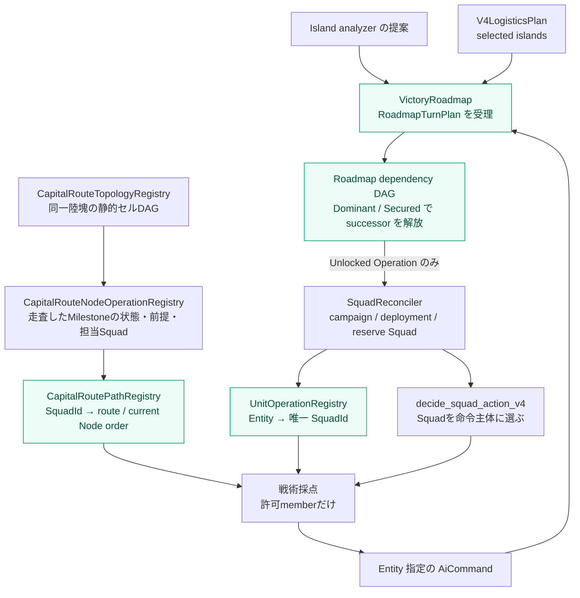
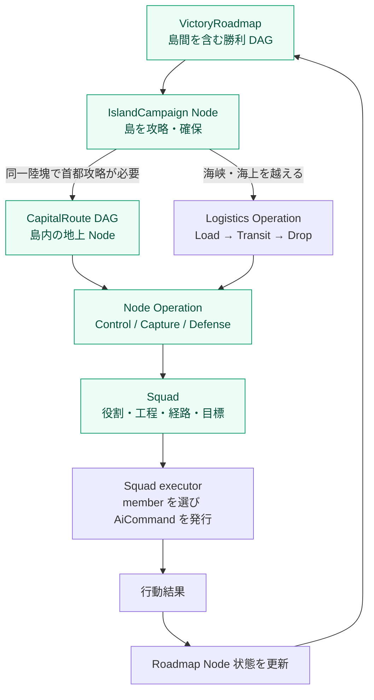
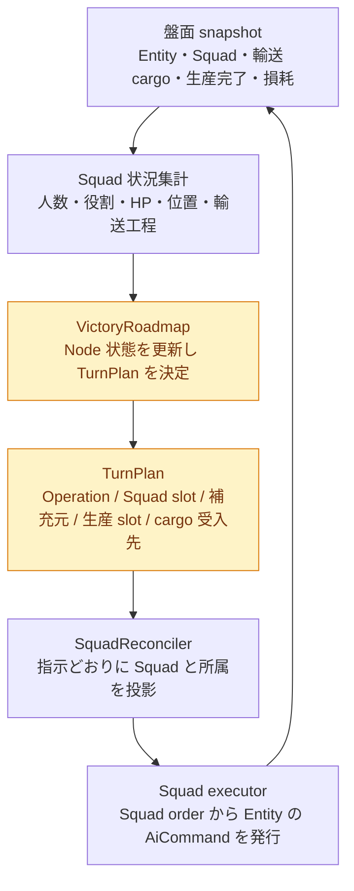

# V4 AI: 現状アーキテクチャと目標設計の乖離

> ステータス: 一部実装・性能未達（2026-08-28 更新）。
> DAG の Squad 化、Roadmap の当ターン TurnPlan 化、Node 状態、Roadmap 依存辺と successor の解放、通常行動の Squad executor、マイルストーンNode Operation、生産 slot予約、境界付き戦略候補探索のデータ経路は実装した。しかし、それらをNodeごとの前衛・予備・生産需要として一つに再計画する実行層は未完成である。候補探索とNode優勢判定は、対戦評価で調整する明示的なヒューリスティックである。
> 2026-08-28: 島内DAG Nodeは、地形・分岐・周辺拠点を走査して `Point` / `Area` を分類する。橋は必ず `Point` とし、橋上への到着ではなく、敵側の最初の非橋セル（出口）への地上部隊到達を通過実績とする。
> 2026-08-28: Nodeの地理情報を実行時の流量制御にも使う。`Point` は前衛1 Squad member、`Area` は control area とCapture対象数の大きい方だけを前衛枠とし、超過Squadは同じDAG区間の既通過セルへ `Stage` 指令で待機させる。待機があるCapture区間には、RollingPlanで必須となった発注を除き、即時の余剰Combat増援を投入しない。

## 結論

`CapitalRoutePathRegistry` は `Entity → commitment` を廃止し、`SquadId → route order` を保持する。行動評価側は `Entity → UnitOperationRegistry → SquadId → route order` とたどるため、DAG は Entity を独立に選別・再配分しない。回復は member 個別の戦術例外であり、Squad order を書き換えない。

また `plan_squads` は、既存の Island analyzer が作った提案を最初に `RoadmapTurnPlan` として Roadmap が受理し、その手番の再編に同じ snapshot を使う。手番末には実際に構築された Squad を再照合して Node 状態と directive を更新する。

`IslandCampaignPortfolio.islands` は **全島の評価** であり、`active_offensives` / `defenses` はそこから allocator が選んだ **実行候補だけ** である。目標座標を持たない `Secured` / `Ignored` 島は Squad を作らないが、評価と Roadmap Node からは消さない。

Roadmap は既存 analyzer の局地提案を入力にするが、そのまま受理しない。攻勢候補の上位3 Nodeについて `Hold` / `Focus` / `Split` の全部分集合（最大8案）を比較し、Defenseを維持したまま、効用最大の一案だけを当ターンのPortfolioへ投影する。生産はその採用済み作戦の発注時にForming Squad slotを予約する。

## 今回実装した境界

- `CapitalRoutePathRegistry` の commitment key を `SquadId` に変更した。
- route waypoint・占領制約・DAG 内移動先は、唯一の所属 Squad が持つ order からのみ導出する。
- `decide_ai_action_v2` は、`UnitOperationRegistry` が選んだ SquadId と一致しない重複 member を行動目標の候補から除外する。
- `VictoryRoadmapRegistry` は `RoadmapTurnPlanRegistry` へ、島 assignment と `Operation → SquadId` directive を手番単位で保存する。
- Island analyzer は全島の assessment と実行候補を分離し、作戦目標がない島も `portfolio.islands` と Roadmap の観測Nodeに残す。
- Roadmap Node に `Locked / Ready / Contested / Dominant / Capturing / Secured / Blocked` を追加した。`OperationPhase`（輸送・戦闘工程）とは別の状態である。
- `V4LogisticsPlan.selected_islands` の順に IslandCampaign Operation を `Logistics` 辺で接続し、敵首都島の Regional Operation から `AssaultCapital` を `CapitalRoute` 辺で接続する。
- 前提 Operation がすべて `Dominant` または `Secured` のときだけ successor を `Ready` 系の状態へ遷移させる。未達なら `Locked` とし、TurnPlan から除外する。
- 完了済みの前提島が Portfolio から外れても `Secured` を維持し、施設を奪い返された場合は再び提案された Node を `Ready`、未提案 Node を `Locked` へ戻す。
- TurnPlan は同一 Squad が複数 Operation に現れないことを検証してから、Squad 再編へ渡す。
- `CapitalRouteNodeOperationRegistry` は、移動用のセルDAGから地形・分岐・周辺拠点を走査して選んだマイルストーンだけを `predecessor / successor / state / assigned Squad` を持つNode Operationとして保持する。単一通過点／単一拠点は `Point`、分岐・合流または複数拠点を含む局地戦は `Area` として分類する。
- V4通常行動は `decide_squad_action_v4` が唯一所属Squadを選び、そのmemberだけを既存戦術採点器へ渡す。戦術器はEntity指定の `AiCommand` を返すが、戦略的な命令主体はSquadである。
- `PendingDeployment` と `CampaignProductionRecord` は発注時にForming Squad slotを発番する。`UnitProducedEvent` は同じ更新でslotを実Squadへ解決する。
- `RoadmapStrategicCandidateRegistry` は候補の種類・対象島・効用・採否を保存し、再編器には採択済みPortfolioだけを渡す。

## 現在の意図的な制約

- 戦略候補は組合せ爆発を避けるため、局地効用が高い攻勢上位3 Nodeの全部分集合までに制限する。Defenseは候補から固定削除しない。
- `Dominant` / `Secured` は、現時点では施設所有・DAG前提・セル上の敵・担当Squadの到達／占領可能memberで判定する。交換比・補給線・敵増援ETAを含む精密化は、評価結果を基にこの観測関数を拡張する。
- 任意の島グラフを自動合成する一般化は行わない。島間は既存の`V4LogisticsPlan.selected_islands`、島内は`CapitalRouteTopology`を正本とする。島内セルDAGの合流edgeは代替経路なので、一つの前任Milestoneが出口条件を満たせば後段へ進める。

## 評価プロトコル

実装の正しさと、実戦での有効性は別々に判定する。前者はunit testで「DAG Nodeの状態遷移」「Entityの一意なSquad所属」「生産完了時のForming slot解決」「候補選択の決定性」を検証する。後者は `scripts/eval_matchup.py --criteria objective` でV3と比較する。

比較評価の設定は、地上DAGの `map_1`、島間輸送を含む `map_3`、広域展開の `map_26`、先攻・後攻の両方、30ターン、同一seedである。各マップ・各手番について、以下をすべて満たしたときだけ合格とする。

1. 最終ターンのZOC支配面積がV3を上回る。
2. 最終ターンの収入がV3を上回る。
3. 15ターン以降のunit資産価値と収入の5ターン移動平均が下降局面に入らない。

勝率（40%以上を目安）・平均思考時間・生産内訳・NPVは、合否を置き換えない診断指標として残す。候補探索の上位3 Node制約、`CapitalRouteNodeOperationRegistry` の状態、未充足slotはJSONL診断で追跡する。正式な性能受入ではseed 42だけに依存せず、追加seedでも同じ先後・マップ集合を実行する。

2026-08-28のseed 42最終実行では、`map_3` は先後とも合格した一方、`map_1` と `map_26` は未達で、全体は不合格だった（V4 2勝4敗、33.3%、平均思考824.6ms/turn）。

同日の `map_6` / seed 101 / 20ターンのV200対V4では、先後ともV4は不合格だった。後攻V4はターン20に、route 0へ21 ground memberをcommitしつつ、Capture Node #21は `Contested`、前衛は7 Squad、production stepは0、未使用資金は248,404だった。これは「DAGがNodeを認識できない」失敗ではなく、待機中の戦力を見て生産を止めるだけで、前衛損耗・敵戦力・他Nodeの不足に応じて待機・増援・資金配分を再計画できていない失敗である。したがって、これを単なるNode効用や兵種重みの調整段階とは扱わない。

## 実装状況

| 項目 | 状態 | 現在の実装／未実装理由 |
| --- | --- | --- |
| Entity 直接の DAG assignment 廃止 | 実装済み | route order は `SquadId` に紐づき、Entity は唯一の所属 Squad 経由で読む。 |
| 全島評価と実行候補の分離 | 実装済み | `islands` は全島の盤面評価、`active_offensives` / `defenses` は実行可能な候補だけを保持する。 |
| Roadmap Node 状態 | 実装済み | `Locked` から `Blocked` までを Operation の工程・実績・所有状態から更新する。 |
| Roadmap の dependency と successor 解放 | 実装済み（限定） | `V4LogisticsPlan.selected_islands` の島間順序と、敵首都島の Regional → Capital を辺にする。全 predecessor が `Dominant` / `Secured` なら解放する。 |
| Locked Node の Squad 編成防止 | 実装済み | Roadmap が TurnPlan へ投影する Portfolio から Locked assignment を除外する。 |
| 完了済み前提 Node の維持・再占領時の再評価 | 実装済み | Portfolio から消えても所有中は `Secured`、奪回後は再提案されれば `Ready`、されなければ `Locked` に戻る。 |
| CapitalRoute のマイルストーン Node Operation | 実装済み | `CapitalRouteNodeOperationRegistry` が、移動用セル列から選んだ拠点群・橋・route入口・首都のID・前後関係・状態・担当Squadを保持する。 |
| Nodeの前衛枠と待機線 | 限定実装 | Point/Areaの地理から前衛枠を算出し、超過Squadを同一路線の生産施設外セルへ`Stage`する。Nodeの損耗・敵圧力・交代時刻を需要として再計画する仕組みはない。 |
| 待機線を含む生産再配分 | 未実装 | `Stage`があるCapture Nodeへの余剰即時Combat生産を止めるだけである。前衛の実効戦力、予備量、敵の増援予測、他Nodeの不足から購入枠を再配分していない。 |
| 前衛の交代・予備の昇格 | 未実装 | 毎ターンのcommitment再生成はするが、前衛枠の空き・HP・占領役不足を入力に、特定のStage Squadを昇格・交代させるRoadmap指令はない。 |
| Squad 専用 executor への構造分離 | 実装済み | `decide_squad_action_v4` がSquad単位でmemberを選び、`decide_ai_action_v2_for_entities` は戦術採点だけを担う。 |
| 戦略候補の比較・枝刈り | 実装済み | 上位3攻勢Nodeの全部分集合を比較し、`Hold` / `Focus` / `Split`から一案を選ぶ。 |
| 生産 slot と Forming Squad slot の予約 | 実装済み | 通常deploymentとCampaign生産の両方で発注時にslotを予約し、生産Eventで実Squadへ解決する。 |

## 用語と責務

| 概念 | 目標設計での責務 | Entity 行動へ直接介入するか |
| --- | --- | --- |
| `VictoryRoadmap` | 島間を含む勝利までの作戦依存 DAG と、各 Node の進捗状態の正本 | しない。Ready な Operation を公開する。 |
| `IslandCampaign` | Roadmap 上の「島を攻略・確保する」Node | しない。現在工程と子 Operation を持つ。 |
| `CapitalRouteTopology` | 同一陸塊で敵首都に向かう、セル単位の地上 DAG | しない。Node／枝／地理制約を提供する。 |
| `Operation` | 1つの Roadmap Node または地上 DAG Node を達成する仕事。Control / Capture / Logistics / Defense 等 | しない。Squad の作成条件と目標を定義する。 |
| `Squad` | Operation を実行する部隊。役割、工程、地理的目標、経路を保持する | **する**。member の候補から Entity 指定のコマンドを発行する。 |
| Entity | Squad が発行したコマンドを実行する主体。ここで対象にするのは命令可能な自軍 Unit であり、Property・Event 等の全 ECS Entity ではない | しない。独立した戦略目標を持たない。 |

## 現行実装

### 実際のデータフロー



### 1. `plan_squads` が行うこと

ターン開始後の最初の `execute_ai_turn_v2` で、通常は `plan_squads` が一度だけ実行される。

1. 既存 Squad を更新し、Reserve を解放し、重複する作戦割当を正規化する。
2. V4 では、同一陸塊に自軍首都と敵首都がある島について、首都間の静的 DAG topology を初回だけ構築する。
3. `IslandCampaignPortfolio` を分析し、DAG の frontier property を同一陸塊の攻勢 assignment の milestone として反映する。
4. campaign Squad、V4 deployment Squad、残 unit 向けの generic Defense / Capture / Attack Squad を順に構築する。
5. 競合 Entity を正規化し、Campaign / Deployment を再接続し、残りを Reserve にする。
6. V4 では analyzer の Portfolio を `VictoryRoadmap` が `RoadmapTurnPlan` として受理し、以降の campaign Squad 編成・一意割当・Reserve 化はこの snapshot を使う。
7. 最後に、実際に構築された Squad を Roadmap へ再照合する。`refresh_capital_route_path_commitments` は Squad ごとの DAG route order を作り、Entity ごとの commitment は作らない。

主要な入口は `engine/src/ai/squad.rs` の `plan_squads`、DAG 処理は `engine/src/ai/v4/mod.rs` にある。

### 2. Roadmap は当ターンの作戦 snapshot と実績を持つ

`reconcile_campaign_roadmap` は、Island analyzer が proposal を出した直後と、Squad を実際に再構築した後の二度実行される。前者が `RoadmapTurnPlan` を作り、同じ `plan_squads` の残りはその Portfolio snapshot だけを使う。後者は Squad ID・Node 状態・実績の観測値を更新する。

Roadmap が現行で直接担うものは以下である。

- 首都強襲 `AssaultCapital` Operation を、局地 Portfolio に現れない期間も保持する。
- 前回からの首都強襲 Entity を保護し、次ターンに Reserve へ落とさない。
- 局地 assault が無い場合、余剰占領兵を首都向け Forming 輸送 Squad に入れる際の fallback target を出す。
- 実行した Attack / Load / Drop / Capture / Wait 等の結果イベントを作戦実績へ記録する。
- Rolling Plan、Deployment、Squad を Roadmap の Operation へ対応付け、予測完了ターン・blocked reason を記録する。

Roadmap は、既存 Island analyzer の局地proposalから境界付きの戦略候補を生成するschedulerである。候補は最大3攻勢Nodeの全部分集合に枝刈りし、RollingPlanが見積もった不足費用・実行可否・継続Squad・現有戦力を効用へ反映して一案を採択する。

### 3. 同一陸塊の DAG は Squad order として配られる

`refresh_capital_route_path_commitments` は、DAG topology がある島の owned ground Squad を収集する。Squad の member 数は route の需要配分に使うが、route を決定・保存する単位は Squad である。

- 対象プレイヤーである。
- `Transporting` ではない。
- 航空・艦船ではない。
- DAG topology がある島にいる。

抽出は Squad 所属を必須とし、輸送 Squad と島をまたぐ Squad は route order の対象外にする。`UnitOperationRegistry` は、行動時に Entity がこの order を読む唯一の Squad を決める。

関数は各 Squad に `CapitalRouteCommitment` を書く。

- `route`: DAG の枝
- `path`: 目標までの DAG セル列
- `target`: その枝の先頭未確保施設
- `execution_target`: phase を考慮して今回目指す地点
- `scope`: 地形・分岐・周辺拠点スキャンから決めた `Point` / `Area`
- `phase`: `Advance` / `Supply` / `Hold`。回復はこの order の phase ではなく、member 個別の戦術例外。

行動器 `decide_ai_action_v2` は、所属 Squad の commitment があると次のように扱う。

- DAG地域の外では `execution_target` を `Squad.target` より優先し、DAGセル列上の前進候補と現在地だけを比較する。
- `Point` に到達した後は、その一点のControlまたはCaptureを実行する。`Area` に入った後は、中心座標への引力を外し、地域内の敵・地形・Capture対象を戦術器が評価する。
- Capture Nodeの占領可能 Entityは、`target` 一点ではなく、そのNodeが走査で関連付けた `capture_targets` だけをCaptureできる。
- 橋Pointは `execution_target` を橋の出口へ置く。非Capture部隊も「占領役を空ける」通常規則で出口手前に止めず、少なくとも一体の地上部隊を出口まで通す。

これは地理的な逸脱防止を維持しつつ、Squad の外側から Entity の目標・移動候補を上書きしない構造である。

### 4. 複数島は Roadmap の依存辺で順序付ける

`CapitalRouteTopology` は、同じ島に自軍首都と敵首都が存在する場合だけ作られる。敵首都が別島なら、島間をまたぐセル DAG は作られない。

その場合は `V4LogisticsPlan.selected_islands` を自軍側から敵首都側への順序として読み、IslandCampaign の Regional Operation を `Logistics` 辺で接続する。最後の兵站島と、敵首都島の前段 Regional Operation は `AssaultCapital` の predecessor になる。

`VictoryRoadmap` はこの辺を保持し、前提がすべて `Dominant` または `Secured` になるまで successor を `Locked` とする。`RoadmapTurnPlan` は Locked Operation の assignment を除外するため、analyzer が後続島を同時に提案しても Squad を先行編成しない。

### 5. 生産は発注時に受入Squad slotを予約する

V4 の生産は目的なく行われているわけではない。Rolling Plan の発注時に `PendingDeployment` が作られ、施設・兵種・anchor・posture・slot・優先敵・PlanStep を保持する。IslandCampaign 向け生産も、発注時点で対象 Island を持つ Campaign 生産記録へ保存される。

`PendingDeployment` は `FormingSquadSlotId`、Campaign生産記録は同等のCampaign slotを発注時に発番する。生産完了の `UnitProducedEvent` は発注意図へ照合されるのと同じSystem更新でslotを実Squadへ解決し、`AssignedDeployment.squad_id` を設定する。CampaignのTransport / Capture / Combatも、島IDと役割を持つForming Squadへただちに入る。生産unitは `HasMoved(true)` / `ActionCompleted(true)` で生成されるため、同じ手番に行動することはない。

従って生産の目的・作戦意図・受入slotはすべて発注時に確定する。次ターンの `plan_squads` はslotの目的を作り直すのではなく、敵targetや編成工程を盤面に合わせて更新する。

## 実装後に残る乖離

| 論点 | 目標設計 | 現行実装 | 影響 |
| --- | --- | --- | --- |
| 作戦の起点 | Roadmap が Ready Node を選ぶ | analyzerの局地proposalから最大8候補を比較し、採択したPortfolioだけをTurnPlanへ渡す | 攻勢Nodeは上位3件に枝刈りする。 |
| DAG の対象 | Operation / Squad が DAG Node を実行する | `CapitalRoutePathRegistry` は Squad ごとの route order。Entity は `UnitOperationRegistry` 経由で読む | DAG が第二の Entity 割当器になる乖離は解消した。 |
| Squad の責務 | Squad が member の行動を出す | `decide_squad_action_v4` がSquadを選び、member限定の戦術採点器がEntity指定commandを返す | 戦術器は別Nodeの目標を変更しない。 |
| 行動目標 | Squad の作戦目標から一意に導出される | route waypoint・capture 制約・移動先は Squad order。Deployment の敵 target は同じ局地作戦内の戦術優先標的 | Deployment の tactical target を Squad order 型へ統合する余地が残る。 |
| 複数島 | 上位 Roadmap の Node / 辺として島 Campaign を扱う | `V4LogisticsPlan.selected_islands` を `Logistics` 辺、敵首都島の Regional → `AssaultCapital` を `CapitalRoute` 辺として `VictoryRoadmap` に保存する | 物流計画が選ばない任意の島グラフはまだ表せない。 |
| ノード進行 | Node の優勢・制圧・補給状態で successor を Ready にする | Roadmapの依存辺は全前提、島内の地理DAGは代替経路の一前任が出口条件を満たせば後段Milestoneを解放する | 優勢判定の観測値・閾値は簡易な既存工程に依存する。 |
| 生産 Entity の所属 | 発注時に Operation と受入 Squad slot を予約し、生成時に Entity へ解決する | 通常deploymentとCampaign生産がslotを予約し、`UnitProducedEvent`で実Squadへ解決する | slotの戦術targetは次回の盤面観測で更新する。 |

## 目標設計

### 階層化した勝利 DAG



### Node の状態遷移

DAG Node は静的な座標だけでなく、毎ターン観測される進行状態を持つ。

```text
Locked
  → Ready        : 前提 Node / 兵站条件を満たした
  → Contested    : 敵味方が拮抗し、制圧作戦が必要
  → Dominant     : 味方優勢。後続 Node を開けられる
  → Capturing    : Node に属する施設を占領中
  → Secured      : 制圧と必要施設確保が完了
  → Blocked      : 戦力・輸送・補給などの不足で再計画が必要
```

現行の観測規則は次のとおりである。セルDAGは移動だけに使い、地形・拠点・橋・route入口・首都を走査して選んだMilestoneだけを状態評価する。地理的な合流は代替経路なので、いずれか一つの前任Milestoneの出口条件を満たしたNodeだけを評価し、地域内の実在地上戦力価値を比較する。`Control` は味方戦力が存在し、敵が過半優勢でなければ `Dominant`、`Capture` は関連する全 `capture_targets` の所有権が自軍になったときだけ `Secured` となる。占領能力を持つ味方が未確保対象にいる間は `Capturing`、敵が局地で優勢なら `Contested` である。

橋Pointは例外的に強い出口条件を持つ。橋上・橋手前の味方戦力は `Dominant` にせず、敵側の最初の非橋セルに地上部隊が出た事実を `crossed` として記録した後だけControl Nodeを解放する。通過部隊がさらに前進しても、敵が橋頭堡へ再侵入していなければ `Secured` を保つ。したがって、`map_26`先攻のように橋が実質的な唯一通路となる地形でも「橋へ近付いた」だけで次Nodeへ進まない。

`Point` / `Area` は状況のたびに恣意的に切り替えない。DAG構築時に、橋ならPoint、分岐・合流または周辺Capture対象が複数ならArea、それ以外の単一通過点／単一拠点ならPointと決める。戦力・所有権・敵位置は毎ターンの状態遷移で観測する。これにより地理モデルと戦況モデルの責務を分ける。

### IslandCampaign は上位 DAG の Node

複数島では、IslandCampaign が全体 DAG の Node となる。島間の辺は地上セルではなく、輸送・兵站・橋頭堡の依存関係である。

```text
自島を確保
  → 輸送作戦が Ready
    → 島A Campaign が Ready
      → 橋頭堡・島内施設を確保
        → 島B Campaign または敵首都島 Campaign が Ready
          → 首都島内の CapitalRoute DAG を進める
```

敵首都島の IslandCampaign は、同一陸塊での攻略が必要なときだけ、内部に `CapitalRouteTopology` の Node を展開する。海上輸送を地上セル DAG へ無理に畳み込まない。

### Squad が命令を出す

DAG は Squad の地理的作戦目標を直接定め、Entity を直接割り当てない。

```text
CapitalRoute Node: 北ルートの工場A周辺
  ├─ Control Operation
  │   └─ Combat Squad: 工場A周辺を制圧・保持する
  └─ Capture Operation
      └─ Capture Squad: 工場Aと同じ Node に属する施設を順に占領する
```

Squad は、Node / Operation から次を受け取る。

- Node または route の ID
- Control 地点または Capture 対象施設集合
- 進軍経路（必要な場合）
- 現在工程（Forming / Transit / Control / Capture / Hold 等）

Squad executor が、現在の盤面とこの命令を使い member の候補行動を出す。ゲームエンジンへ送る命令は Entity 指定の `AiCommand` だが、意味上の命令主体は Squad である。

### Nodeの前衛・待機線・生産の接続

Nodeは「全Squadがanchorへ移動する先」ではない。Nodeが `Point` なら橋や狭路を通れる量は一点分、`Area` なら局地戦の広さだけである。DAGの地理スキャン結果から前衛枠を決め、その枠に入ったSquadだけが `Advance` として Control / Capture を実行する。

枠を超えたSquadは作戦を失わず `Stage` になる。`Stage` の移動先は、同一DAGの起点から当該Nodeまでにある既通過セルのうち、自軍生産施設を除いたセルである。従って、後続は生産拠点の周囲で停滞せず、同じ作戦の予備として保持される。待機中のCapture Squadは対象施設を先取りして占領しない。どの予備をいつ前衛へ昇格させるかは、後述の未実装項目である。

この待機数は生産判断にも返す。Capture Nodeにすでに `Stage` Squadがいる場合、同一Nodeへの即時Combat増援は「戦力不足の解消」ではなく渋滞を増やすだけなので候補から除外する。ただしRollingPlanが必須とした最低編成・既に予約済みのForming slotは止めない。これにより、DAGは地理・状態・流量を定め、RoadmapはどのNodeへ資源を配るかを定め、Squadはその実行単位のまま保たれる。

## 目標設計の不変条件

1. Property・Event・破棄済み Entityは、Squad 所属を要求しない。輸送中 cargo は独立行動しないが、輸送 Squad の cargo として関連付ける。
2. すべての生産決定は、発注時点で1つの Operation と1つの受入 Squad slot（Forming Squad を含む）を予約する。生産完了時には予約 slot を実 Entity へ解決する。
3. AI が現在の手番に `AiCommand` を発行できる自軍 Unit は、最大1つの Squad に所属する。命令を出すなら、その Squad が唯一の決定主体である。
4. 通常作戦の Squad は1つの Operation に所属する。Reserve は、待機・再配置を命令する必要がある限り明示 Squad として扱う。
5. Operation は1つの Roadmap Node（IslandCampaign または CapitalRoute Node）を達成対象に持つ。
6. DAG の枝・Node は Squad に割り当てられ、Entity に独立して直接割り当てられない。
7. 1 Entity の行動時に読む戦略目標は、所属 Squad の命令から一意に導出される。
8. 戦術評価は Squad 命令の許容範囲で Attack / Capture / Wait / Move 等を選ぶが、別 Node への目的変更はしない。
9. Node 状態を更新して successor を Ready にする責務は Roadmap にある。

### Roadmap と Squad 再編の責務分離

Squad の再編器が「どの Squad を主力にするか」「不足部隊をどの作戦へ回すか」「撤収するか」を独自に決めると、Roadmap と並ぶ第二の戦略決定者になる。その構造では、Roadmap に記録された作戦と実際の Squad 構成が再び乖離する。

意思決定の正本は Roadmap である。再編器は盤面の事実を集計し、Roadmap が出した当ターンの編成指示を Entity / Squad の状態へ投影するだけに限定する。



`SquadReconciler` が Roadmap へ返せるのは事実だけである。例えば「Control Squad A は戦車 1 / 2、歩兵 2 / 2 で Understrength」「輸送便が到着したが受入 Squad は存在しない」「生産予約 slot が未充足」といった差分を報告する。補充・再編・撤収・新規 Forming Squad の可否は、その Operation と Node の優先度を知る Roadmap が決める。

Roadmap が出す `TurnPlan` は、少なくとも次の対応を固定する。

```text
Roadmap Node
  → OperationId
    → SquadPlan (既存 SquadId または Forming slot)
      → role / Node order / 必要編成 / 許可された補充元
      → 生産予約 slot / 輸送 cargo の受入 role slot
```

これにより、退却・部隊壊滅・輸送完了は「再編器が次の作戦を発明する契機」ではなく、「Roadmap が既存 Operation を継続・補充・撤収・中止のいずれにするかを再決定する入力」になる。

- 負傷 Entity が退却しても、Operation と Squad の関係は `Recovering` として保持し、回復後は同じ Squad order に戻す。戦力集計では一時的に非稼働として扱う。
- Squad の生存 member が 1 体でも、直ちに解散しない。Roadmap がその Operation を継続すると決め、予約生産・回復中 member・増援計画があるなら `Forming` / `Understrength` として保持する。
- 輸送 cargo は固定の `SquadId` ではなく `OperationId + role slot` を予約する。到着時に生存中の受入 Squad へ解決し、受入 Squad が失われても Operation が継続中なら Roadmap の指示で Forming Squad を作って受け入れる。作戦が撤収・中止なら、輸送側は cargo を勝手に汎用 Squad へ放出しない。

## 方向転換時の対応表

| 現行要素 | 維持／変更 | 目標上の位置づけ |
| --- | --- | --- |
| `CapitalRouteTopologyRegistry` | 維持 | 同一陸塊の静的な地上 DAG。Node・辺・施設との対応だけを持つ。 |
| `CapitalRoutePathRegistry` | 大幅変更 | Entity→path commitment ではなく、Squad→route / node order を保持する。 |
| `IslandCampaignPortfolio` | 変更 | Roadmap が公開する Ready Node / Operation を当ターン実行分へ切り出す scheduler にする。 |
| `VictoryRoadmapRegistry` | 昇格 | 後段の監査台帳ではなく、Node 状態・依存関係・Ready 判定の正本にする。 |
| `UnitOperationRegistry` | 維持・拡張 | Entity→Squad→Operation の一意な所属を保証する。 |
| `V4DeploymentRegistry` | 統合 | `PendingDeployment` を要求元 Operation と予約済み Squad slot に結び、生産 Event で slot を実 Entity へ解決する。 |
| `decide_ai_action_v2` | 分割／縮小 | 全 Entity の戦略目標を決めず、Squad が出した候補の戦術的な採点に限定する。 |

## 現在の判定規則（評価で調整する値）

- `CapitalRouteNodeOperation` は、地形・分岐・周辺拠点を初回に走査して移動セル列をマイルストーンへ圧縮し、Point/Areaを決める。毎ターンは所有権・局地戦力・占領役・橋出口への地上部隊到達だけを投影する。Squadがanchorへ未到着であること自体はNodeを`Contested`にしない。
- 分岐後の合流は、地理的には **いずれか一つの predecessor の出口条件** が満たされたときに解放する。Controlは `Dominant` または `Secured`、Captureは全対象を取った `Secured`、橋Controlは出口到達済みの `Dominant` または `Secured` が出口条件である。Roadmapの島間依存辺とは別の意味である。
- IslandCampaign候補の効用は、decisionの戦略価値、実行可否、継続Squad、現有戦力を加点し、RollingPlan由来の不足予算と同時攻勢数を減点する。
- `Control` はPointなら通過点の確保、Areaなら地域優勢の形成であり、`Capture` はNodeに関連付けた対象施設集合を占領して完了する。
- V1〜V3は従来の`decide_ai_action_v2`を維持し、V4だけが`decide_squad_action_v4`を通す。これが段階移行の明示境界である。

## 実装した戦略候補比較と RollingPlan の分担

> この節は、実装した境界付き探索の背景と、意図的に探索を広げない理由を記録する。

### この議論の背景

ここで議論しているのは、Roadmap がターン開始時に「どの Squad をどこへ向かわせ、どの目的で何を生産するか」を一つに決める方法である。すべての作戦が最終的に敵首都攻略へ着地する、という前提は変わらない。

ただし、首都へ向かう地理的な経路だけを選んでも、実際の資源配分は決まらない。同じ経路を選んだとしても、ある Node では占領役を補充して前進し、別の Node では現有 Squad だけで維持し、さらに別の Node は撤収する、といった選択がある。生産・Squad・Entity がそれぞれ独自にこれを決めると、同じ資金や Entity を複数の作戦が取り合う。

この節で実装した問いは、次の一つである。

> 首都攻略へ向かう複数の Node が同時に存在するとき、Roadmap は「どの Node を前進・維持・撤収するか」と「それに資源をどう配るか」を、どう比較して一つの方針に決めるか。

### 盤面例

次のような状況を考える。

```text
Node A: 敵首都へ至る北ルート上の工場。
        戦闘では優勢だが、占領可能な歩兵がいないため工場を取れていない。

Node B: 別方向の港または橋頭堡。
        今すぐ首都へ向かう主経路ではないが、敵に取られると輸送・収入・退路の
        いずれかを失う可能性がある。
```

限られた資金で歩兵を 1 体だけ生産できるとき、少なくとも次の考え方があり得る。

```text
案1: A の歩兵を生産して工場を占領する。B は現有戦力で維持する。
案2: A の前進は延期し、B を補強して安全を確保する。
案3: A の歩兵を生産して前進する。B は失っても首都経路が保てると判断して撤収する。
```

この案1〜3は、兵種の組合せの違いではなく「国全体の資源をどの Node のどの状態変化へ使うか」の違いである。ここでいう戦略案は、主経路に加えてこの配分方針を含む。

### 実装上の用語

異なる粒度の候補を同じ `Plan` と呼ばないため、実装では次の境界を使う。

| 名称 | 何を表すか | 例 |
| --- | --- | --- |
| 戦略案（`StrategicCandidateEvaluation`） | 上位3攻勢Nodeの部分集合と、その効用 | 「Aだけを進める」「AとBを進める」 |
| Node状態 | 1 Nodeの現在の前提・制圧・占領状態 | 「A は `Contested`、前段は `Dominant`」 |
| 局地編成案（RollingPlan） | 選ばれたNodeを成立させる兵種・費用・ETAの見積 | 「歩兵1を生産すれば2ターンで A を占領できる」 |
| 承認済み作戦指示（`RoadmapTurnPlan`） | 採用したPortfolioとOperation→Squad指示 | 「A用歩兵を工場Xで生産し、予約slotのCapture Squadへ入れる」 |

`Hold` は攻勢部分集合を空にした候補として実装している。ただし実行可能または継続中の攻勢がある場合は、shortfallの過大評価で全攻勢を消さないよう空集合を候補から除く。Defenseはどの候補でも削除しない。`HoldUntil` / `Withdraw` を個別型として増やす前に、まずこの有限候補と対戦評価で必要な表現力を確認する。

### 実装した分担

Roadmap は、案1〜3のような Node 間の選択を行う唯一の主体とする。首都までの依存関係、輸送・補給の必要性、既存の予約、資金・工場・Squad の全体的な排他関係を扱う。

RollingPlan は、Roadmap が評価したい 1 つの Node 遷移候補に対して、「局地敵情と既存 Squad を前提に、成立させるには何を生産・補充すればよいか」を計算する。RollingPlan は A と B のどちらを優先するか、新しい Node を作るか、撤収するかを決めない。

```text
Roadmap:
  「A を占領する案と、B を維持する案の必要資源を知りたい」
    ↓ Node 遷移候補
RollingPlan:
  「A の占領には歩兵1・2ターン・1,000Gが必要」
  「B の維持には追加生産なしで3ターン可能」
    ↓ 局地編成案
Roadmap:
  「このターンは案1を採用する」
    ↓ OperationDirective
生産器 / SquadReconciler:
  A 用の生産予約と Squad slot を実体へ反映する
```

敵の現在戦力、到達 ETA、敵生産施設・生産可能兵種・収入は、上の両者が参照する観測情報である。Roadmap は Node が優勢・危険・維持不能かを判断するために使い、RollingPlan は個別の Node 遷移が実際に成立するかを計算するために使う。この観測情報自体が Entity の目標を直接変更してはならない。

### 枝刈り規則

戦略案には複数Nodeの選択が入るため、全組合せを列挙しない。現在は次を確定規則として実装している。

1. analyzerが出した攻勢assignmentを局地効用順に並べ、上位3件だけを残す。
2. その全部分集合を生成する（最大 `2^3 = 8`）。空集合は`Hold`、1件は`Focus`、2件以上は`Split`である。ただしReadyまたは継続中の攻勢があれば空集合は除く。
3. 各候補は、assignmentの戦略価値・実行可否・継続Squad・現有戦力から不足予算と分散ペナルティを引いて採点する。
4. 同点なら同時攻勢数が少ない候補、次に島ID順を選び、評価試合で決定が揺れないようにする。
5. Defense assignmentは全候補に残る。攻勢を絞るために固定の`MinimalDefense`を導入しない。

RoadmapがNode間の資源配分を決め、RollingPlanは選ばれた局地課題の成立性を計算する、という責務境界をこの有限探索で実行している。
